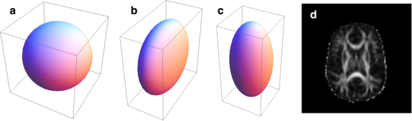
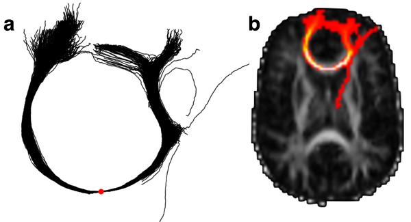
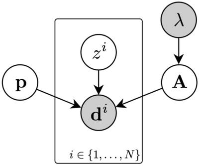

```{r, echo=FALSE}
knitr::opts_chunk$set(collapse=TRUE, comment="#>")
Sys.setenv(TRACTOR_HOME="/usr/local/tractor")
options(reportrPrefixFormat="")
```

*Please note that this is an updated version of the [original TractoR paper](http://www.jstatsoft.org/v44/i08/), which was published in the* Journal of Statistical Software *in 2011. Please cite the reference below if you use TractoR in your work.*

*J.D. Clayden, S. Muñoz Maniega, A.J. Storkey, M.D. King, M.E. Bastin & C.A. Clark (2011). TractoR: Magnetic resonance imaging and tractography with R.* Journal of Statistical Software **44***(8):1-18.*

*This version of the paper is based on v3.0.1 of TractoR, but does not cover the full scope of this more recent release. (The current version at the time of original publication was v1.8.2.) Please see <http://www.tractor-mri.org.uk> for more information about the package and its authors.*

## Abstract

Statistical techniques play a major role in contemporary methods for analysing magnetic resonance imaging (MRI) data. In addition to the central role that classical statistical methods play in research using MRI, statistical modelling and machine learning techniques are key to many modern data analysis pipelines. Applications for these techniques cover a broad spectrum of research, including many preclinical and clinical studies, and in some cases these methods are working their way into widespread routine use.

In this manuscript we describe a software tool called TractoR (for "Tractography with R"), a collection of packages for the R language and environment, along with additional infrastructure for straightforwardly performing common image processing tasks. TractoR provides general purpose functions for reading, writing and manipulating MR images, as well as more specific code for fitting signal models to diffusion MRI data and performing tractography, a technique for visualising neural connectivity.

## Introduction

Magnetic resonance imaging (MRI) is a noninvasive medical imaging technique which is used routinely in hospitals worldwide. By exploiting fundamentally quantum-mechanical characteristics of water molecules in the presence of a strong magnetic field, MRI can recover detailed images of body tissues at a resolution of around 1 mm. Unlike many other medical imaging methods, MRI uses no ionising radiation, and therefore permits repeated scanning.

MRI is also a very flexible technique. By manipulating the nuclear magnetic resonance signal from water molecules, a broad variety of tissue contrasts can be obtained. Of particular interest in this paper is diffusion MRI (dMRI), wherein image intensity at each pixel (or voxel for 3D images) depends on the local pattern of self-diffusion of water ([Le Bihan, 2003](#bibliography)). Since elements of body tissue such as cell membranes present obstacles to diffusion, these images can provide information about microscopic tissue structure; and the orientation of highly linear structures such as the brain's white matter can also be inferred.

The development of new MRI analysis techniques is a major area of research, and some of the ideas generated by this research are filtering through to clinical applications. Statistical techniques play a very important part in many of these new developments. Currently, MATLAB is probably the most widely-used programming language for the development of new MRI analysis tools, with the statistical parametric mapping (SPM) package being a notable example ([Friston et al., 2007](#bibliography)); but C++, Java and Python are also common choices. Due to its statistical pedigree and vectorised programming model, R ([R Core Team, 2016](#bibliography)) is a strong candidate for software development in this field.

In this paper we introduce a software package called **TractoR** (for "Tractography with R"), which consists of several R packages, along with a simple command line based front-end and some associated infrastructure for performing common MRI analysis tasks. TractoR is free software, available from <http://www.tractor-mri.org.uk> under the terms of the GNU Public Licence, version 2.

## Package overview and conventions

The core functionality of TractoR is provided in seven R packages. The **tractor.base** package provides general functions for reading, writing and manipulating magnetic resonance images; **tractor.reg** handles image registration or co-alignment; **tractor.session** maintains the various image files associated with a particular scan session or subject, and provides interfaces to third-party software; **tractor.track** provides core functions for performing diffusion [fibre tracking](#fibre-tracking); **tractor.nt** implements ["neighbourhood tractography"](#neighbourhood-tractography); **tractor.graph** provides data structures and algorithms to support graph-based "connectome" analyses; and **tractor.utils** provides various utility functions, primarily used by the TractoR [shell interface](#the-tractor-shell-interface).

The session abstraction obviates the need for the user to keep track of the locations of large numbers of files, instead following a convention for simplicity. The general layout in the current version of TractoR is shown in the table below, and the **tractor.session** package provides accessor functions for obtaining the true path to a particular image, such as the fractional anisotropy map (located at `tractor/diffusion/dti_FA` by default). The user may specify alternative paths for particular files if necessary, through the use of so-called "session maps".

Directory               | Purpose
----------------------- | -----------------------------------------------
`tractor`               | Top-level managed directory
`tractor/transforms`    | Stored transformations between different spaces
`tractor/diffusion`     | Diffusion-weighted images and their derivatives (e.g. diffusion tensor components)
`tractor/fdt`           | Images and other files used by FSL's diffusion toolbox
`tractor/fdt.bedpostX`  | Images and other files produced by FSL BEDPOSTX
`tractor/structural`    | Structural (e.g. $T_1$-weighted) images
`tractor/freesurfer`    | Output from the Freesurfer pipeline
`tractor/functional`    | Functional (generally $T_2^*$-weighted BOLD) images

Classes in TractoR are implemented primarily as R reference classes, with a number of methods for accessing and modifying encapsulated data, which are called directly on the object. This will be demonstrated explicitly in the next section.

## The MriImage class

The core data type used in TractoR is the `MriImage`. This class is defined in the **tractor.base** R package, along with methods for reading and writing objects from and to standard medical image file types, visualisation and flexible image manipulation. This data type consists of a dense or sparse array of voxel intensity values, along with a set of metadata describing the voxel dimensions, coordinate origin and storage format of the image.

The standard file format used by TractoR to store `MriImage` objects on disk is the [NIfTI-1 format](http://nifti.nimh.nih.gov/nifti-1), a widely-supported standard in medical imaging. Reading an image from such a file is simple.

```{r}
library("tractor.base")
i <- readImageFile(file.path(Sys.getenv("TRACTOR_HOME"), "share", "mni", "brain.nii.gz"))
```

(Note that this example requires that the full TractoR distribution has been installed, and that the `TRACTOR_HOME` environment variable has been correctly set to point to its location on disk.) This particular image is a standard representation of the brain in Montréal Neurological Institute space (MNI space; see [Evans et al., 1994](#bibliography)), provided by McGill University. Information about the image can be obtained through its `print()` method.

```{r}
print(i)
```

Access to the array of voxel values stored with the image, or specific elements of metadata, is through a series of accessor functions.

```{r}
d <- i$getData()
class(d)
dim(d)
i$getOrigin()
```

A full list of methods available for the `MriImage` class—or, analogously, any other reference class defined by TractoR—may be obtained by calling the `methods()` method on an object of the relevant class.

```{r}
i$methods()
```

Slices of an image, maximum intensity projections and "contact sheet" style visualisations of all image slices can be easily created, with the aspect ratio of the image set according to the voxel dimensions. Simple image processing operations such as applying a lower intensity threshold can also be applied, and more sophisticated image processing is available through the **mmand** package ([Clayden, 2016a](#bibliography)), which is provided as part of the full TractoR distribution, or available separately from the Comprehensive R Archive Network.

```{r}
createSliceGraphic(i, z=80)
j <- i$copy()$threshold(50)
createSliceGraphic(j, z=80)
```

The plane of the graphic is set by the option `z=80`, indicating the slice perpendicular to the *z*-axis (bottom-to-top), 80 voxels from the bottom of the brain volume. Notice that the image is first copied before thresholding it; otherwise, the threshold would be applied to the original.

Arbitrary functions of one or more images may also be applied easily, using the `map()` method, as in the examples below.

```{r}
k <- i$copy()$map(function(x) x^2)
l <- i$copy()$map("*", j)
```

The first of these produces a new image whose voxel values are the squares of the original, while the second multiplies two images together. The latter may be achieved more succinctly using the standard multiplication operator, as in `i*j`.

Finally, an `MriImage` may be created from a standard R array object, by using another `MriImage` as a template, or by specifying the metadata explicitly. In the following example we create a mask image whose value is 1 wherever the original image is positive, and 0 everywhere else. This could be more simply achieved using the `binarise()` method, but the longer version is instructive.

```{r}
d <- array(as.integer(i$getData() > 0), dim=i$getDimensions())
j <- asMriImage(d, i)
print(j)
```

The first line here binarises the original image, and the second uses the original image as a template to create a new `MriImage`.

### Handling DICOM files

DICOM (for Digital Imaging and Communications in Medicine; see <http://dicom.nema.org>) is an extremely complex standard for storing and transferring medical imaging information, and is the format in which image data is usually obtained from an MRI scanner. An `MriImage` object may be created from a directory of related DICOM files, where each file represents a slice of a larger image, and subsequently converted to NIfTI-1 format.

```{r}
# First copy DICOM files into a temporary directory
dir.create(path <- tempfile())
file.copy(file.path(Sys.getenv("TRACTOR_HOME"), "tests", "data", "dicom", c("01.dcm","02.dcm")), path)

# Now read and convert the files
info <- readDicomDirectory(path)
print(info$image)
writeImageFile(info$image, "image", "NIFTI")
```

The output file will be called "image.nii". (A gzipped NIfTI file, or image/header pair, may be obtained by substituting `"NIFTI_GZ"` or `"NIFTI_PAIR"` as the last argument to `writeImageFile`.)

Alternatively, a DICOM file may be read into a `DicomMetadata` object, which retains all of the information stored in the file. Individual DICOM "tags", containing information about the scan acquisition, may then be extracted.

```{r}
m <- readDicomFile(file.path(Sys.getenv("TRACTOR_HOME"), "tests", "data", "dicom", "01.dcm"))
m$getTagValue(0x0018, 0x0087)
tractor.base:::getDescriptionForDicomTag(0x0018, 0x0087)
```

## Modelling the diffusion-weighted signal

The **tractor.session** package for R defines the `MriSession` class, which encapsulates a single scanning session with a single subject, and manages a hierarchy of image files and other information which relate to that scan. Since several of these files are involved in performing most data processing tasks, the abstraction obviates the necessity to specify each of these files individually---rather, only the top-level directory containing the session data need be given explicitly.

Some initial preprocessing is required to move from a set of raw data files acquired from an MRI scanner to a data set ready for fibre tracking as laid out below, and the **tractor.session** package provides tools to perform that preprocessing, but those steps are omitted here for brevity. The `dpreproc` script, inside the full TractoR distribution's `share/experiments` subdirectory, demonstrates how each of the standard preprocessing steps can be achieved. They are conversion of DICOM files to NIfTI-1 format if required (as described [above](#handling-dicom-files)), brain extraction and coregistration of diffusion-weighted volumes.

### The diffusion tensor

Diffusion MRI data are usually acquired as a series of 3D volumes, each of which has an associated diffusion sensitising magnetic gradient applied along a particular direction relative to the scanner's native coordinate system, represented as a normalised column vector, $\mathsf{G}$. Under the assumption that the spatial distribution of diffusing water molecules after a particular time, $t$, is 3D Gaussian, the relationship between the signal amplitude in the presence of diffusion sensitisation, $S$, and the signal without it, $S_0$, is

$$\frac{S(b,\mathsf{G})}{S_0} = \exp \left(-b \mathsf{G}^{\mathsf{T}} \mathsf{D} \mathsf{G} \right) \; .$$

Here, $b$ is the diffusion "weighting factor", which depends on the diffusion time and the strength of the magnetic gradient applied. $\mathsf{D}$ is known as the "effective diffusion tensor", represented relative to the scanner's coordinate system, and is related to the covariance matrix of the 3D Gaussian molecular displacement distribution by $\Sigma=2\mathsf{D}t$. Using the equation above, the elements of the diffusion tensor matrix may be estimated in each voxel of the brain from the log-transformed signal intensities with and without diffusion weighting, using ordinary or weighted least-squares estimation, or more sophisticated methods where required. The combination of dMRI acquisition with diffusion tensor estimation is referred to as diffusion tensor imaging ([Basser et al., 1994](#bibliography)).

With the diffusion tensor estimated at each voxel in the brain, it is common for many applications to calculate the eigenvalues, $\lambda_1$, $\lambda_2$ and $\lambda_3$, of each tensor, along with various derived quantities. The eigenvalues represent effective diffusivities, generally specified in mm<sup>2</sup> s<sup>-1</sup>, along the principal axes of the displacement distribution. From these are typically calculated measures such as mean diffusivity (MD), the mean of the eigenvalues, $\bar{\lambda}$, and fractional anisotropy (FA), given by

$$\textrm{FA} = \sqrt{\frac{3}{2}} \sqrt{\frac{(\lambda_1-\bar{\lambda})^2 + (\lambda_2-\bar{\lambda})^2 + (\lambda_3-\bar{\lambda})^2}{\lambda_1^{\,2} + \lambda_2^{\,2} + \lambda_3^{\,2}}} \; .$$

Considering the isosurface of probability density after a given diffusion time as an ellipsoid, MD describes the volume of the ellipsoid while FA describes its shape. FA is zero for a spherical ellipsoid, representing isotropic diffusion, while it is close to unity when one eigenvalue is substantially larger than the others, corresponding to a prolate ellipsoid (subfigures a–c, below). The white matter of the brain is highly linearised, and FA is consequently higher in these regions (subfigure d).



Diffusion tensor fitting may be performed with TractoR using either ordinary least-squares or iterative weighted least-squares approaches. The latter is recommended due to heteroskedasticity in the log-transformed signal intensities ([Salvador et al., 2005](#bibliography)). It may be performed as follows.

```{r, eval=1:2}
library("tractor.session")
s <- attachMriSession(file.path(Sys.getenv("TRACTOR_HOME"), "tests", "data", "session"))
createDiffusionTensorImagesForSession(s, method="iwls")
```

This command will use preprocessed data files already stored in the specified session directory to estimate diffusion tensors at each image voxel, and write out a series of images representing various quantities derived from it or its diagonalisation, including MD and FA. (Be aware that running this command on the test data supplied with TractoR exactly as given will overwrite some standard test files, and may lead to some of TractoR's self-tests failing afterwards. It is therefore preferable to use a copy of the test data, or a different data set, when experimenting.) Ordinary least-squares tensor fitting may be performed by substituting `method="ls"` into the last command. The full path to any particular image created within the session directory in this way may be obtained as follows.

```{r}
s$getImageFileNameByType("FA")
```

An interface to the tensor estimation tool in the FMRIB Software Library (FSL; see [Smith et al., 2004](#bibliography); <http://fsl.fmrib.ox.ac.uk>) may be used as an alternative, for its somewhat faster speed, as follows.

```{r, eval=FALSE}
runDtifitWithSession(s)
```

In this case only the ordinary least-squares method is used, and FSL must be installed on the user's system as well as TractoR.

We note that other diffusion signal models, such as a Gaussian mixture model or the so-called "q-ball" model, can be fitted to dMRI data using the **dti** R package ([Polzehl & Tabelow, 2009](#bibliography)).

### A sampling-based approach

The assumption of a 3D Gaussian molecular displacement distribution for self-diffusion of water in living tissue is oversimplistic. Even in highly linear white matter, more complex patterns of diffusion occur regularly at the crossings of multiple pathways ([Jones, 2008](#bibliography)). For the purpose of fibre tracking, discussed in the next section, it is therefore usually desirable to allow for contributions from multiple fibre populations with different orientations. One such generalisation, described by [Behrens et al. (2007)](#bibliography) and often referred to as the "ball and sticks" model, treats the displacement distribution as a mixture of pure isotropic and anisotropic components. Assuming that the orientation of the $i$th fibre population is given by the column vector $\mathsf{N}_i$, the signal model then becomes

$$\frac{S(b,\mathsf{G})}{S_0} = \left(1-\sum_i f_i \right) \exp(-bD) + \sum_i f_i \exp \left(-bD \left( \mathsf{G}^{\mathsf{T}} \mathsf{N}_i \right)^2 \right) \; ,$$

where $f_i \in [0,1]$ is the volume fraction of the $i$th anisotropic component, and $D$ is the effective diffusivity.

In a standard dMRI acquisition, the known values in the equation above are $b$ and $\mathsf{G}$, while $S$ and $S_0$ are observed, and $D$, $(f_i)$ and $(\mathsf{N}_i)$ are to be estimated. Rather than calculate point estimates of these parameters, ([Behrens et al., 2007](#bibliography)) put forward a Markov chain Monte Carlo (MCMC) approach to estimating their posterior distributions. (The priors used by the algorithm as published are uninformative. Noise in each voxel is modelled to be independent and identically distributed Gaussian, with a Gamma distribution prior on the precision parameter.) They refer to their algorithm as BEDPOST (Bayesian Estimation of Diffusion Parameters Obtained using Sampling Techniques). The algorithm is provided as part of FSL, and TractoR provides a simple interface to it for R, viz.

```{r, eval=FALSE}
runBedpostWithSession(s, nFibres=3)
```

Here, the `nFibres` argument determines the maximum number of anisotropic components allowed per voxel, i.e., the upper limit on $i$ in the model in the equation above. BEDPOST uses the automatic relevance determination framework on the volume fraction parameters, $(f_i)$, to set priors which allow the weights of components to be forced to zero where they are irrelevant for predicting the signal (see [MacKay, 1995](#bibliography)). In this way, only as many components are maintained in each voxel as are supported by the data. BEDPOST typically takes several hours to run, at the end of which a number of new files are created within the session directory, representing the estimated distributions for each parameter of interest—notably the orientation vectors, $(\mathsf{N}_i)$.

## Fibre tracking

Diffusion fibre tracking, or "tractography", is the process of reconstructing white matter tract trajectories by following the local orientation information estimated as [described above](#modelling-the-diffusion-weighted-signal). It has a wide spectrum of applications in clinical imaging and neuroscience.

### Tracking from single seed points

The standard algorithm for performing streamline tractography from a single seed point may be described as follows.

1. Start with the current "front" of the streamline set to the seed point.
2. Sample a local fibre orientation at the streamline front.
3. Move the front some small distance in the direction of the sampled direction.
4. Return to step 2, and repeat until a stopping criterion is met.
5. Return to step 1 and repeat once, travelling in the opposite direction away from the seed point.

Step 2 in the process described above involves some subtlety. Firstly, if a point estimate of the local fibre orientation is used—such as the principal eigenvector of a single diffusion tensor—then the sampling is deterministic. If MCMC is used to estimate a distribution over orientations, on the other hand, then the sampling may be repeated multiple times with different results in general. Thus, multiple streamlines may be generated from a single seed point. Local uncertainty will tend to accumulate in the streamlines' trajectories as one moves away from the seed point, and a set of streamlines generated in this way give an indication of the precision available for tracking pathways from the seed. Secondly, in models of diffusion allowing for multiple anisotropic components, multiple fibre directions may be present within each voxel, and one must therefore decide which component to sample from. The convention is usually to sample from all components, and then choose the sample which is most similar to the orientation of the previous step; but alternative strategies are possible, and may be more robust (e.g., [Clayden & Clark, 2010](#bibliography)).

White matter pathways terminate in grey matter, which does not have the orientational coherence of white matter, and orientation uncertainty is therefore very high in these areas. Stopping criteria usually ensure that the streamline does not leave the brain or turn back on itself, but entering grey matter may also be a reason to stop tracking.



Assuming BEDPOST has already been run on the session directory, single seed tractography can be run as follows.

```{r}
library("tractor.track")
s <- attachMriSession(file.path(Sys.getenv("TRACTOR_HOME"), "tests", "data", "session"))
p <- s$getTracker()$run(c(50,59,33), count=1000, requireStreamlines=TRUE)
```

The first argument to the `run()` method of the tracker provides the 3D coordinates of the seed point—using the R convention of indexing from one—and `count` is the number of streamlines to generate. (If `count` is set to 1, then only a single streamline is generated, and the result is analogous to "deterministic" tractography.) The resulting set of streamlines is written to a file in TrackVis ".trk" format ([Wang & Wedeen, 2015](#bibliography)), which may be visualised in the TrackVis program, or else plotted within R as shown in the figure above.

A common method of presentation for tractography results is as a visitation map or spatial histogram, an image with the same resolution as the original dMRI images wherein each voxel's value is the number of streamlines which pass through it. An example is shown in subfigure b, above, as a maximum intensity projection overlaid on a slice of the FA image. This type of visualisation may be created using the following TractoR code.

```{r}
fa <- s$getImageByType("FA")
i <- StreamlineSource$new(p)$getVisitationMap(fa)
createSliceGraphic(fa, z=33)
createProjectionGraphic(i, axis=3, colourScale=2, add=TRUE)
```

Note that an object of class `StreamlineSource` is created as a wrapper around the ".trk" file full of streamlines created above, and the visitation map is retrieved by calling this object's `getVisitationMap()` method. The `axis` option in the last line controls the axis of the projection, while the `colourScale` option is used to select a heatmap, rather than greyscale, colour lookup table for the overlay. Since `add=TRUE` is given, the projection is overlaid on the FA slice graphic created by the previous command.

If only a visitation map is required, without the intermediate set of streamlines, then the same effect may be achieved using the command

```{r}
i <- readImageFile(s$getTracker()$run(c(50,59,33), count=1000))
```

This works because the `run()` method of the `Tracker` class returns the path to the file or files that it creates.

### Tracking between regions

An alternative to single seed tractography, which is relevant to many applications, is tracking between regions of the brain. Under this arrangement, a seed region is used to generate streamlines, and one or more "waypoint" regions are used to constrain their paths. In most implementations, streamlines which do not pass through all of the waypoint regions are simply discarded.

TractoR provides facilities for identifying target regions and filtering out streamlines that do not reach them. For example,

```{r}
# Create a 3 x 3 x 3 voxel neighbourhood
n <- createNeighbourhoodInfo(3)

# Duplicate the FA map twice, fill each with 0s, and then add 1s
# within the neighbourhood of a point in each case
seed <- fa$copy()$fill(0L)
seed[t(n$vectors + c(42,66,32))] <- 1L
target <- fa$copy()$fill(0L)
target[t(n$vectors + c(58,66,33))] <- 1L

# Retrieve the session's tracker and set options, then track
tracker <- s$getTracker()$setTargets(target)$setFilters(minTargetHits=1)
i <- readImageFile(tracker$run(seed$getNonzeroIndices(), count=500))

# Visualise the result, and the original regions of interest
createSliceGraphic(fa, z=32)
createProjectionGraphic(i, axis=3, colourScale=2, add=TRUE)
createSliceGraphic(seed, z=32, colourScale="green", add=TRUE)
createSliceGraphic(target, z=32, colourScale="blue", add=TRUE)
```

In this case, the `count` option controls the number of streamlines generated *per seed point* within the mask. These commands create a seed mask and waypoint mask (each as a 3 x 3 x 3 voxel block), run tractography using them, and visualise the results. The visualisation is built up with an FA slice as the base layer, then a projection of the tract, and finally the two regions of interest.

### Neighbourhood tractography

"Neighbourhood tractography" is an alternative to waypoint methods, which uses a reference tract and machine learning methods to find consistent representations of a particular tract of interest in a group of dMRI data sets ([Clayden et al., 2007, 2009b](#bibliography)). The principle is to model the variation in shape of the tract across individuals, and then evaluate the plausibility of a given "candidate tract" as a match to the reference tract. The **tractor.nt** package provides functions and supporting data structures for performing neighbourhood tractography, and a standard set of reference tracts are provided with the main TractoR distribution ([Muñoz Maniega et al., 2008](#bibliography)). New reference tracts may also be created by the user.

Reference and candidate tracts are represented for these purposes as B-splines with a fixed distance between knot points. Where multiple streamlines are generated from a single seed point, the spline is fitted to the spatial median of the set. One knot is arranged to coincide with the seed point, and for the $i$th candidate tract in a data set there are then $L_1^i$ knots to one side of the seed, and $L_2^i$ to the other. Working away from the seed point, we denote the angle between the straight line connecting knot $u-1$ to knot $u$, and its equivalent in the reference tract, with $\phi^i_u$. The index, $u$, is taken as being negative to one side of the seed, and positive to the other side.

A set of indicator variables, $(z^i)$, describe which candidate tract is the best match to the reference tract within the data set, such that $z^i=1$ if tract $i$ is the best match and $z^i=0$ otherwise. The special case $z^0=1$ is also allowed, to indicate no match. The likelihood of the model given the observed data then depends on the value of the relevant indicator variable. Our aim is to establish the posterior distribution $P(z^i\,|\,D)$, where $D$ represents all data\footnote{Note that the data here are not the raw images acquired from the scanner, but rather the variables describing tract shape which are derived from them.}, for all candidate tracts, subject to the constraint that

$$\sum_{i=0}^N P(z^i=1) = 1 \, ;$$

i.e., there is exactly one best match, or none.

Given the shape and length data for the best matching tract and an appropriate reference tract, the likelihood is given by

$$P(\mathbf{d}^i\,|\,\mathbf{A},\mathbf{p},z^i=1) = P(L^i_1\,|\,L^*_1,\mathbf{p}_1,z^i=1) \, P(L^i_2\,|\,L^*_2,\mathbf{p}_2,z^i=1) \prod_{u=1}^{\check{L}^i_1} P(\phi^i_{-u}\,|\,\alpha_u,z^i=1) \prod_{u=1}^{\check{L}^i_2} P(\phi^i_{u}\,|\,\alpha_u,z^i=1) \; ,$$

where $\mathbf{d}^i = (L_1^i,L_2^i,(\phi_u^i))$, $\mathbf{A}=(\alpha_u)$ and $\mathbf{p}=(\mathbf{p}_1,\mathbf{p}_2)$---the latter two being parameters of the model. $L^*_1$ and $L^*_2$ are the lengths of the reference tract corresponding to $L^i_1$ and $L^i_2$ respectively; $\check{L}^i_1 = \min \{ L^i_1, L^*_1 \}$, and equivalently for $\check{L}^i_2$. The corresponding forward model for tracts which do not match the reference (\ie with $z^i=0$) is uninformative, since the reference tract is not a good predictor of their topologies.



A graphical representation of this model is shown above, and the distributional details are as follows.

\begin{align}
  L^i_1 \, | \, L^*_1 \sim \mathrm{Multinomial}(n_1,\mathbf{p}_1) \nonumber \\
  L^i_2 \, | \, L^*_2 \sim \mathrm{Multinomial}(n_2,\mathbf{p}_2) \\
  \frac{\cos \phi^i_u + 1}{2} \sim \mathrm{Beta}(\alpha_u,1) \nonumber
\end{align}

where $n_1 = |\mathbf{p}_1|$, and equivalently for $n_2$. Multinomial distributions are appropriate for the tract length variables because they reflect the number of knots either side of the seed point, which must be integral. The true length of the tract is therefore approximated by the sum of the fixed-length gaps between knots. We apply the prior

$$\alpha_u - 1 \sim \mathrm{Exponential}(\lambda) \; ,$$

which constrains each $\alpha_u$ to ensure that smaller deviations from the reference tract are always more likely (\ie $\alpha_u \geq 1$), and also regularises their distributions to avoid model overfitting for small data sets.

The model may be fitted in a supervised fashion by choosing a set of training tracts representing good matches to the reference \citep{clayden2007}, or taking an unsupervised approach using an Expectation--Maximisation (EM) algorithm ([Clayden et al., 2009b](#bibliography)). The unsupervised approach is generally preferable in applications, unless test data are very scarce, in which case it may be helpful to train from another population. The same framework may also be used to remove individual streamlines which are inconsistent with the trajectory of the reference tract ([Clayden et al., 2009a](#bibliography)).

A set of B-spline tract representations suitable for training or evaluating against a model may be created using the following commands.

```{r}
library("tractor.nt")
s <- attachMriSession(file.path(Sys.getenv("TRACTOR_HOME"), "tests", "data", "session"))
r <- getNTResource("reference", "pnt", list(tractName="genu"))
n <- createNeighbourhoodInfo(centre=c(50,59,33), width=3)
l <- calculateSplinesForNeighbourhood(s, n, r, nStreamlines=100)
```

Here, we are using the standard reference for the "genu" tract as the reference, and creating B-spline candidate tracts for every point within a $3 \times 3 \times 3$ voxel neighbourhood centred at (50,59,33). (The `getNTResource()` function is used to obtain various standard resources provided with TractoR for performing neighbourhood tractography. In this case, we are requesting a reference tract, `"reference"`, associated with tract name `"genu"`, appropriate for probabilistic neighbourhood tractography, `"pnt"`.) Each B-spline is fitted to the median of 100 sampled streamlines. We must then calculate the components of $\mathbf{d}^i$ for each seed point, and this is achieved with

```{r}
d <- createDataTableForSplines(l, r$getTract(), "knot", sessionPath=s$getDirectory(), neighbourhood=n)
```

The reference tract needs to be provided here to calculate the angles, $(\phi^i_u)$, between segments of the reference and candidate tracts.

We can now fit a model using these B-spline tracts as training data. (Of course, this is not wise in practice without manually removing aberrant tracts, and in any case tracts from several data sets should be used for a generalisable model, but this serves to illustrate the method.)

```{r}
m <- newMatchingTractModelFromDataTable(d, r$getTract(), lambda=1, alphaOffset=1, weights=NULL, asymmetric=TRUE)
print(m)
```

The model object has class `MatchingTractModel`. The values of `lambda` ($\lambda$), `alphaOffset` and `weights` specified here will have a significant effect on the outcome---indeed, with only one subject in the data set, the prior dominates in this example, limiting the values of $\alpha_u$ severely. The larger the value of `lambda`, the greater the extent to which the prior will favour small values of $\alpha_u$, since the exponential prior has mean $1/\lambda$. A value of `alphaOffset=1` corresponds to the prior given above. If the specified weights are `NULL`, then each tract is given the same weight. In the EM context, this corresponds to an assumption that each tract is *a priori* equiprobable. The `asymmetric` parameter determines whether a constraint that $\alpha_u = \alpha_{-u}$ should be applied (the symmetric case) or not (the asymmetric case). It is generally wise to set this to `TRUE` unless very few data are available.

The trained model generated above may be used directly to calculate the posterior matching probabilities of a new set of candidate tracts. However, in applications it is often helpful to work in an unsupervised fashion, learning the model and calculating posteriors in one go, since this removes the need for separate training data. This can be achieved as follows.

```{r, cache=TRUE}
m <- runMatchingEMForDataTable(d, r$getTract(), lambda=1, alphaOffset=1, asymmetricModel=TRUE)
print(m$mm)
which.max(m$tp[[1]])
```

The list `m$tp` gives the tract matching posteriors for each subject in the data set. Here, under the final model, the 2nd (of 27) candidate tracts has the highest posterior. The mean FA within this tract may finally be calculated as follows.

```{r}
# Read the visitation map, threshold and binarise it
i <- readImageFile(s$getTracker()$run(n$vectors[,2], count=1000))
i$threshold(0.01*max(i))$binarise()
fa <- s$getImageByType("FA")

# Find the average FA within the nonzero voxels of the thresholded map
mean(fa[i$getNonzeroIndices()], na.rm=TRUE)
```

This represents the mean FA within the region visited by at least 1\% (`i$threshold(0.01*max(i))`) of the streamlines initiated from the final seed point. Mean FA values from a full data set may then be analysed using standard R hypothesis testing functions such as `t.test()` or `cor.test()`.

It should be noted that there is considerable scope in the code provided with the **tractor.nt** package for adjusting the exact processes applied, or for using similar models for other purposes, but we have focussed on a standard usage here for brevity.

## The TractoR shell interface

In addition to the three main R packages whose major functionality has been laid out above, TractoR provides a shell interface and set of related R "experiment scripts" for performing various common tasks quickly and directly. In addition, it allows those without experience of working with R to use some of TractoR's core functionality immediately. An additional R package, **tractor.utils**, exists mainly to support this interface. It should be noted that the interface uses a Unix shell script and is therefore not directly usable in Windows.

The interface works through a single shell script program called `tractor`, which may be executed by typing just its name if the `bin` subdirectory of the TractoR distribution is on the user's `PATH`. Specific tasks are chosen by giving the name of a particular experiment script: for example, the `dpreproc` script may be used for preprocessing dMRI data, the `track` script can be used for performing tractography, and so on. All available experiment scripts may be listed by using the `list` script, viz.

```{bash}
tractor list
```

In addition, a description and list of supported arguments and options for a particular script may be obtained by using the `-o` flag to the `tractor` program.

```{bash}
tractor -o mean
```

The `tractor` program has a full Unix `man` page, and that may be consulted for further details on how to use and configure this interface. Finally, it is possible to call these scripts from R, using the `callExperiment()` function.

```{r}
library("tractor.utils")
callExperiment("imageinfo", file.path(Sys.getenv("TRACTOR_HOME"),"share","mni","brain"), outputLevel=OL$Info)
```

## Conclusion

In this paper we have described **TractoR**, a set of R packages along with a separate shell interface and scripting platform for processing magnetic resonance images in general, and dMRI data in particular. The package provides facilities for general-purpose reading, writing and manipulation of 2D, 3D and 4D images, along with signal modelling, tractography and tract shape modelling functions specific to dMRI. Relatively recent additions which have not been explicitly covered in this paper include image registration using the **RNiftyReg** package ([Clayden, 2016b](#bibliography)), and graph-based "connectome" analysis. It is intended that this platform will continue to broaden in the future, making further use of the comprehensive statistical capabilities of the R language and package ecosystem.

## Bibliography

Basser PJ, Mattiello J, Le Bihan D (1994). "Estimation of the Effective Self-Diffusion Tensor from the NMR Spin Echo." *Journal of Magnetic Resonance, Series B*, **103**(3), 247–254.

Behrens TEJ, Johansen-Berg H, Jbabdi S, Rushworth MFS, Woolrich MW (2007). "Probabilistic Diffusion Tractography with Multiple Fibre Orientations: What Can We Gain?" *NeuroImage*, **34**(1), 144–155.

Clayden JD (2016a). "mmand: Mathematical Morphology in Any Number of Dimensions." Version 1.3.0, <https://cran.r-project.org/package=mmand>.

Clayden JD (2016b). "RNiftyReg: Image Registration Using the NiftyReg Library." Version 2.3.0, <https://cran.r-project.org/package=RNiftyReg>.

Clayden JD, Clark CA (2010). "On the Importance of Appropriate Fibre Population Selection in Diffusion Tractography." In *Proceedings of the ISMRM-ESMRMB Joint Annual Meeting*, p. 1679. International Society for Magnetic Resonance in Medicine.

Clayden JD, King MD, Clark CA (2009a). "Shape Modelling for Tract Selection." In GZ Yang, D Hawkes, D Rueckert, A Noble, C Taylor (eds.), *Medical Image Computing and Computer-Assisted Intervention*, volume 5762 of *Lecture Notes in Computer Science*, pp. 150–157. Springer-Verlag.

Clayden JD, Storkey AJ, Bastin ME (2007). "A Probabilistic Model-Based Approach to Consistent White Matter Tract Segmentation." *IEEE Transactions on Medical Imaging*, **26**(11), 1555–1561.

Clayden JD, Storkey AJ, Muñoz Maniega S, Bastin ME (2009b). "Reproducibility of Tract Segmentation Between Sessions Using an Unsupervised Modelling-Based Approach." *NeuroImage*, **45**(2), 377–385.

Evans A, Kamber M, Collins DL, MacDonald D (1994). "An MRI-Based Probabilistic Atlas of Neuroanatomy."  In S Shorvon, D Fish, F Andermann, GM Bydder, H Stefan (eds.), *Magnetic Resonance Scanning and Epilepsy*, volume 264 of *NATO ASI Series A, Life Sciences*, pp. 263–274. Plenum Press.

Friston K, Ashburner J, Kiebel S, Nichols T, Penny W (eds.) (2007). *Statistical Parametric Mapping: The Analysis of Functional Brain Images.* Academic Press, New York.

Jones DK (2008). "Studying Connections in the Living Human Brain with Diffusion MRI." *Cortex*, **44**(8), 936–952.

Le Bihan D (2003). "Looking into the Functional Architecture of the Brain with Diffusion MRI." *Nature Reviews Neuroscience*, **4**(6), 469–480.

MacKay DJC (1995). "Probable Networks and Plausible Predictions — A Review of Practical Bayesian Methods for Supervised Neural Networks." *Network: Computation in Neural Systems*, **6**(3), 469–505.

Muñoz Maniega S, Bastin ME, McIntosh AM, Lawrie SM, Clayden JD (2008). "Atlas-Based Reference Tracts Improve Automatic White Matter Segmentation with Neighbourhood Tractography." In *Proceedings of the ISMRM 16th Scientific Meeting & Exhibition*, p. 3318. International Society for Magnetic Resonance in Medicine.

Polzehl J, Tabelow K (2009). "Structural Adaptive Smoothing in Diffusion Tensor Imaging: The R Package dti." *Journal of Statistical Software*, **31**(9), 1–23.

R Core Team (2016). "R: A Language and Environment for Statistical Computing." R Foundation for Statistical Computing.

Salvador R, Peña A, Menon DK, Carpenter TA, Pickard JD, Bullmore ET (2005). "Formal Characterization and Extension of the Linearized Diffusion Tensor Model." *Human Brain Mapping*, **24**(2), 144–155.

Smith SM, Jenkinson M, Woolrich MW, Beckmann CF, Behrens TEJ, Johansen-Berg H, Bannister PR, De~Luca M, Drobnjak I, Flitney DE, Niazy RK, Saunders J, Vickers J, Zhang Y, De~Stefano N, Brady JM, Matthews PM (2004). "Advances in Functional and Structural MR Image Analysis and Implementation as FSL." *NeuroImage*, **23 Suppl 1**, S208–S219.

Wang R, Wedeen VJ (2015). "TrackVis." Version 0.6.0, <http://www.trackvis.org>.
